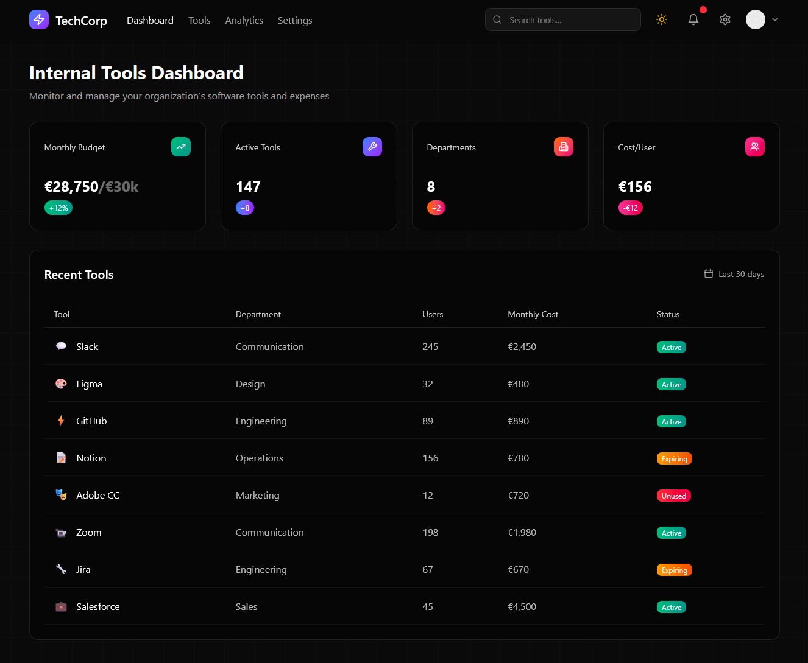

# 📋 TEST TECHNIQUE FRONTEND - 3 JOURS

# 

## **🎯 MISSION GLOBALE**

**Produit :** Internal Tools Management Dashboard (Application complète)\n**User :** Admin IT interne\n**Challenge :** Construire une application de monitoring des outils SaaS en 3 phases progressives


---

## **📅 PROGRESSION DÉVELOPPEMENT**

### **🚀 JOUR 6 : DASHBOARD PAGE** *(Base Foundation)*

* **Référence :** Mockup fourni

 


 


* **Objectif :** Établir le design system de base
* **Livrables :** Header + KPIs + Recent Tools + Responsive

### **⚡ JOUR 7 : TOOLS PAGE** *(Autonomous Consistency)*

* **Référence :** VOTRE dashboard (aucun mockup)
* **Objectif :** Maintenir la cohérence sans guide visuel
* **Livrables :** Catalogue complet + Filtres + Management

### **📊 JOUR 8 : ANALYTICS PAGE** *(Advanced Integration)*

* **Référence :** VOS pages précédentes (cohérence totale)
* **Objectif :** Intégration de data visualization cohérente
* **Livrables :** Charts + Insights + Navigation fluide


---

## **🎨 DESIGN REFERENCE ÉVOLUTIF**

### **🎨 Jour 6 - Style Foundation :**

* **Theme :** Dark moderne avec gradients colorés ou light
* **Inspiration :** Vercel, Linear, Figma dashboards
* **Couleurs :** Background dark + gradients purple/blue/pink
* **Icons :** Lucide React ou Heroicons
* **Typography :** Inter ou system fonts

### **🔄 Jour 7-8 - Style Consistency :**

* **COHÉRENCE ABSOLUE** : Réutiliser 100% du design system J6
* **Header identique** : Navigation évolutive mais cohérente
* **Components library** : Réutiliser cards, buttons, badges, forms
* **Color palette** : Strictement identique aux choix J6
* **NO NEW STYLES** : Extension, pas réinvention


---

## **⚡ STACK TECHNIQUE GLOBAL**

### **Imposé sur 3 jours :**

* **Styling :** Tailwind CSS (obligatoire)
* **Icons :** Lucide ou Heroicons (cohérence)
* **Typography :** Inter ou system fonts
* **Routing :** Navigation entre les 3 pages

### **Libre choix :**

* Framework/library JavaScript (React, Vue, Svelte...)
* Build tools (Vite, Webpack, Next...)
* State management (Context, Zustand, Redux...)
* API handling (Fetch, Axios, TanStack Query...)
* Charts library (Chart.js, Recharts, D3... - Jour 8 uniquement)


---

## **📊 FONCTIONNALITÉS PAR PAGE**

## **🏠 DASHBOARD (Jour 6)**

### **1. HEADER FOUNDATION**

```jsx
// Base pour les 3 pages
- Logo TechCorp + titre
- Navigation: Dashboard | Tools | Analytics | Settings
- Search bar fonctionnelle (adaptative par page)
- Notifications badge (avec compteur)
- User avatar + dropdown menu
- Responsive hamburger menu
```

### **2. KPIs CARDS**

```jsx
// Métriques dashboard

Budget: €28,750/€30k (avec progress bar +12%)
Active Tools: 147 (+8 trend)
Departments: 8 (+2)
Cost per User: €156 (+€10)

// Style de référence pour autres pages
- Gradients colorés (vert, bleu, rouge, rose)
- Icons dans coins
- Animations hover subtiles
- Grid responsive (2x2 → 1x4)
```

### **3. RECENT TOOLS TABLE**

```jsx
// Template pour Tools page

Tool | Department | Users | Monthly Cost | Status

// Status system de référence
"Active" (green), "Expiring" (orange), "Unused" (red)

// Interactions de base
- Hover rows avec background change
- Tri par colonnes (au moins 2)
- Pagination (10 items/page)
- Actions dropdown (View, Edit, Delete)
```


---

## **🔧 TOOLS PAGE (Jour 7)**

### **1. HEADER ÉVOLUTIF**

```jsx
// Navigation mise à jour

Dashboard | Tools (active) | Analytics | Settings
// Search adaptée: "Search in tools catalog..."
```

### **2. TOOLS CATALOG COMPLET**

```jsx
// Extension de Recent Tools

Tous les outils du JSON (15+) avec:
- Grid cards OU table détaillée (votre choix UX)
- Tool icon, name, description complète
- Category, Status (mêmes badges), User count
- Monthly cost, Last update, Department
- Quick actions (Edit, View details, Disable/Enable)

// Style cohérent obligatoire
- Mêmes status badges que Dashboard
- Mêmes hover states et animations
- Loading/empty states dans le même style
```

### **3. FILTRES & RECHERCHE AVANCÉS**

```jsx
// Sidebar ou top filters

By Department: All, Engineering, Marketing, Design, etc.
By Status: Active, Expiring, Unused

By Cost Range: Slider ou input ranges  
By Category: Communication, Development, Design, etc.

// Search dans header

Multi-criteria, suggestions optionnelles
```

### **4. TOOLS MANAGEMENT**

```jsx
// CRUD Operations

Add New Tool: Modal/page avec form validation

Tool Details: Vue détaillée (modal ou route)
Bulk Operations: Multi-select avec actions

Status Management: Enable/Disable/Archive workflows

// Même UX patterns que Dashboard

Confirmations, success states, error handling
```


---

## **📈 ANALYTICS PAGE (Jour 8)**

### **1. NAVIGATION FINALE**

```jsx
// Header complet fonctionnel

Dashboard | Tools | Analytics (active) | Settings
// Search: "Search metrics, insights..."
```

### **2. COST ANALYTICS**

```jsx
// Charts cohérents avec design system

Monthly Spend Evolution: Line chart avec gradients

Department Cost Breakdown: Pie/donut avec vos couleurs

Top Expensive Tools: Horizontal bars

Budget Progress: Même style que KPIs Dashboard

// Style integration obligatoire

Charts utilisant votre color palette

Backgrounds gradients comme vos cards
```

### **3. USAGE ANALYTICS**

```jsx
// Métriques d'adoption

User Adoption Rates: Par outil avec trends

Most/Least Used Tools: Ranking avec mini charts

Department Activity: Comparaisons visuelles

Growth Trends: Timeline des nouveaux outils

// Interactions avancées

Time range picker (30d, 90d, 1y)
Drill-down par département

Filters cohérents avec Tools page
```

### **4. INSIGHTS DASHBOARD**

```jsx
// Business Intelligence

Cost Optimization Alerts: Même style que vos badges

Unused Tools Warnings: Cards cohérentes

ROI Calculations: Métriques dans style KPIs

Usage Patterns: Heatmaps, sparklines

// Navigation cross-page

Links vers Tools page (voir détail outil)
Retour Dashboard pour KPIs
```


---

## **📱 RESPONSIVE STRATEGY GLOBAL**

```css
// Breakpoints cohérents 3 pages

Mobile (%3C 640px): 
  - Stack layouts, hamburger menu
  - Cards en single column
  - Charts simplified/stacked

Tablet (640-1024px): 
  - Mixed layouts, sidebar filters
  - 2-col grids, collapsible panels
  - Interactive chart legends

Desktop (%3E 1024px): 
  - Full layouts, all features
  - Multi-column dashboards
  - Complete chart interactions

// Touch-friendly sur mobile (3 pages)
Larger tap targets, swipe navigation optionnelle
```


---

## **🔥 DIFFÉRENCIATEURS PROGRESSIFS**

### **Jour 6 - Foundation Excellence:**


1. **Pixel perfect mockup** : Reproduction exacte
2. **Loading states créatifs** : Skeleton screens
3. **Error UX soignée** : Messages contextuels
4. **Dark/Light toggle** : Theme switcher
5. **Tests unitaires** : Composants clés

### **Jour 7 - Consistency Mastery:**


 6. **Design system respect** : Zéro incohérence visuelle
 7. **Advanced Filters UX** : Multi-criteria intuitive
 8. **Bulk Operations** : Sélection intelligente
 9. **Add Tool Workflow** : Modal multi-step
10. **Tool Recommendations** : Suggestions smart

### **Jour 8 - Integration Sophistication:**


11. **Interactive Charts** : Hover details, drill-downs
12. **Cross-page Navigation** : Deep-links tools ↔ analytics
13. **Predictive Insights** : Cost projections
14. **Export Reports** : PDF/Excel avec style cohérent
15. **Real-time Updates** : Live data refresh


---

## **📦 RESSOURCES FOURNIES**

### **JSON Server Backend**

* **URL Base :** <https://tt-jsonserver-01.alt-tools.tech/>


#### **📊 Main resources**

```bash

GET /departments       # List of 5 departments
GET /users             # List of 66 users  
GET /tools             # List of 24 SaaS tools
GET /user_tools        # User-tools relationships
GET /analytics         # KPIs, budget and dashboard metrics
```

#### **🔍 Filtering and search**

```bash
# Filter active users
GET /users?active=true

# Tools by status
GET /tools?status=active
GET /tools?status=unused  
GET /tools?status=expiring

# Users by department
GET /users?department_id=1

# Search by name
GET /users?name_like=John
GET /tools?name_like=Slack
```

#### **🎯 DASHBOARD SPECIAL ENDPOINTS**

```bash
# Recent Tools (8 last updated tools)
GET /tools?_sort=updated_at&_order=desc&_limit=8

# Tools by descending cost
GET /tools?_sort=monthly_cost&_order=desc

# Complete budget analytics
GET /analytics
```

#### **📈 Relations and joins**

```bash
# Users with their department
GET /users?_embed=department

# Tools with relationships
GET /tools?_embed=user_tools

# User relationships
GET /users/1/user_tools
```

#### **🔄 Pagination and sorting**

```bash
# Page 1, 10 items
GET /users?_page=1&_limit=10

# Sort by name
GET /tools?_sort=name&_order=asc

# Sort by cost
GET /tools?_sort=monthly_cost&_order=desc
```

### **💾 DATA STRUCTURE**

#### **Department**

```json
{
  id: number
  name: string // "Engineering", "Design", etc.
  description: string
  created_at: string
  updated_at: string
}
```

#### **User**

```json
{
  id: number
  name: string
  email: string
  department_id: number
  role: string // "Senior Developer", "UX Designer", etc.
  active: boolean
  joined_at: string // "YYYY-MM-DD"
}
```

#### **Tool**

```json
{
  id: number
  name: string // "Slack", "Figma", etc.
  description: string
  vendor: string
  category: string // "Development", "Design", etc.
  monthly_cost: number
  previous_month_cost: number 
  owner_department: string
  status: "active" | "unused" | "expiring"
  website_url: string
  active_users_count: number
  icon_url: string 
  created_at: string
  updated_at: string
}
```

#### **UserTool**

```json
{
  user_id: number
  tool_id: number
  usage_frequency: "daily" | "weekly" | "monthly" | "rarely"
  last_used: string // ISO date
  proficiency_level: "beginner" | "intermediate" | "advanced" | "expert"
}
```

#### **Analytics**

```json
{
  budget_overview: {
    monthly_limit: number        // 30000
    current_month_total: number  // Current total
    previous_month_total: number // Previous month total  
    budget_utilization: string   // "95.8%" 
    trend_percentage: string     // "+12.0"
  },
  kpi_trends: {
    budget_change: string        // "+12%"
    tools_change: string         // "+9"
    departments_change: string   // "+2"
    cost_per_user_change: string // "-€12"
  },
  cost_analytics: {
    cost_per_user: number        // 156
    previous_cost_per_user: number // 168
    active_users: number         // 56
    total_users: number         // 66
  }
}
```


\

---

## **📝 LIVRABLE FINAL ATTENDU**

### **Format :**

* **Dépôt GitHub public** avec historique des 3 jours
* **3 routes fonctionnelles :** `/`, `/tools`, `/analytics`
* **Navigation fluide** entre toutes les pages
* **Responsive complet** sur tous les devices

### **Structure attendue :**

```
src/
├── components/           # Design system réutilisé
├── pages/               # Dashboard, Tools, Analytics
├── hooks/               # Data fetching logic
├── utils/               # Helpers, constants
├── styles/              # Tailwind config, globals
└── README.md            # Documentation complète
```


---

## **📖 README FINAL OBLIGATOIRE**

### **🚀 Quick Start**

*Installation et lancement en une commande*

### **🏗️ Architecture**

*Structure projet et organisation du code sur 3 pages*

### **🎨 Design System Evolution**

*Comment le design s'est construit et maintenu sur 3 jours*

### **🔗 Navigation & User Journey**

*Flow utilisateur complet : Dashboard → Tools → Analytics*

### **📊 Data Integration Strategy**

*Gestion des données du JSON server à travers les pages*

### **📱 Progressive Responsive Design**

*Approche mobile-first et adaptation par page*

### **🧪 Testing Strategy**

*Tests unitaires et stratégie QA sur l'ensemble*

### **⚡ Performance Optimizations**

*Techniques utilisées pour une app 3-pages optimale*

### **🎯 Design Consistency Approach**

*Comment vous avez maintenu la cohérence sans mockups J7-J8*

### **📈 Data Visualization Philosophy**

*Choix de charts library et intégration design system*

### **🔮 Next Steps / Complete App Vision**

*Évolutions possibles pour une app SaaS Tools complète*


---

## **🎯 SUCCESS CRITERIA**

✅ **Cohérence Visuelle :** Aucune rupture de style entre les 3 pages\n✅ **Navigation Fluide :** UX seamless Dashboard ↔ Tools ↔ Analytics\n✅ **Responsive Excellence :** Expérience parfaite mobile → desktop\n✅ **Code Quality :** Architecture claire, components réutilisables\n✅ **Data Integration :** JSON server exploité intelligemment\n✅ **UX Sophistication :** Interactions, states, micro-animations


---

**💡 Le vrai challenge : Construire un design system cohérent SANS guide visuel après J6**