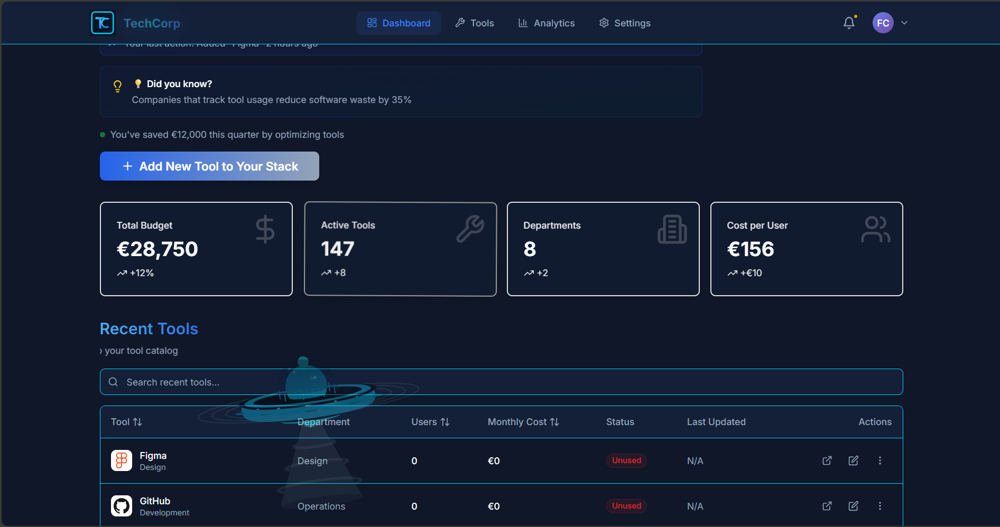

# 🚀 Internal Tools Management Dashboard

> Un dashboard moderne et interactif pour la gestion et la visualisation des outils internes d'entreprise.

[](https://fchehidi.github.io/Internal-Tools-Management-Dashboard/)
[](https://github.com/FCHEHIDI/Internal-Tools-Management-Dashboard/actions/workflows/deploy.yml)
[](https://reactjs.org/)
[](https://www.typescriptlang.org/)
[](https://vitejs.dev/)


## 🌐 Démo en ligne

**URL du projet déployé** : [https://fchehidi.github.io/Internal-Tools-Management-Dashboard/](https://fchehidi.github.io/Internal-Tools-Management-Dashboard/)

## 📋 Description du projet

Application web full-stack permettant de gérer un catalogue d'outils internes avec des fonctionnalités avancées de visualisation, filtrage, tri et export de données. Le projet intègre des animations 3D interactives et une interface utilisateur moderne et responsive.

### 🎯 Objectifs

- Centraliser la documentation des outils internes de l'entreprise
- Fournir une interface intuitive pour rechercher et filtrer les outils
- Permettre l'export des données en différents formats (Excel, CSV)
- Visualiser des statistiques et KPIs en temps réel
- Démontrer les compétences en développement frontend moderne

## ✨ Fonctionnalités principales

### 📊 Dashboard
- **KPI Cards** : Visualisation des statistiques clés (Total des outils, Catégories, Utilisateurs, Taux d'adoption)
- **Graphiques interactifs** : Répartition par catégorie, statut, et tendances d'utilisation
- **Design moderne** : Dégradés gold/platinum/sapphire/ruby avec animations fluides

### 🔧 Catalogue d'outils
- **24 outils référencés** : Slack, Figma, GitHub, Notion, JIRA, etc.
- **Filtres avancés** :
  - Par catégorie (Communication, Design, Development, Project Management, etc.)
  - Par statut (Active, Inactive, Deprecated)
  - Recherche par nom ou description
- **Tri dynamique** : Par nom, catégorie, utilisateurs, date d'ajout
- **Vue carte/liste** : Interface adaptative selon les préférences

### 📥 Export de données
- **Format Excel** : Export complet avec mise en forme
- **Format CSV** : Compatible avec tous les tableurs
- **Colonnes personnalisables** : Sélection des champs à exporter
- **Aperçu instantané** : Visualisation avant export

### 🎨 Expérience utilisateur
- **Animations 3D** : Modèle UFO interactif avec Three.js et React Three Fiber
- **Dark mode** : Interface sombre élégante
- **Responsive design** : Optimisé pour desktop, tablette et mobile
- **Tooltips informatifs** : Aide contextuelle sur tous les éléments

## 🛠️ Technologies utilisées

### Frontend
- **React 18.3** - Bibliothèque UI moderne avec hooks et concurrent features
- **TypeScript 5.6** - Typage statique pour plus de robustesse
- **Vite 5.4** - Build tool ultra-rapide avec HMR
- **Tailwind CSS 3.4** - Framework CSS utility-first
- **TanStack Query v5** - Gestion d'état et cache des données API
- **React Router 7.1** - Routing côté client
- **React Hook Form** - Gestion des formulaires performante
- **Zod** - Validation de schémas TypeScript-first

### 3D & Animations
- **Three.js 0.170** - Bibliothèque 3D WebGL
- **React Three Fiber 8.18** - Renderer React pour Three.js
- **React Three Drei** - Helpers et composants 3D prêts à l'emploi

### Data & Export
- **XLSX (SheetJS)** - Export Excel avec formatage
- **Axios** - Client HTTP pour les requêtes API
- **date-fns** - Manipulation de dates moderne

### DevOps & Qualité
- **ESLint** - Linting du code
- **Prettier** - Formatage automatique
- **GitHub Actions** - CI/CD automatisé
- **GitHub Pages** - Hébergement statique gratuit

## 📦 Installation et lancement

### Prérequis
- Node.js 18+ 
- npm ou yarn

### Installation

```bash
# Cloner le repository
git clone https://github.com/FCHEHIDI/Internal-Tools-Management-Dashboard.git
cd Internal-Tools-Management-Dashboard

# Installer les dépendances (avec résolution des peer dependencies)
npm install --legacy-peer-deps

# Lancer le serveur de développement
npm run dev
```

L'application sera accessible sur `http://localhost:5173`

### Scripts disponibles

```bash
npm run dev          # Démarrer le serveur de développement
npm run build        # Compiler pour la production
npm run preview      # Prévisualiser le build de production
npm run lint         # Vérifier le code avec ESLint
```

## 🌐 API Backend

Le projet utilise un serveur JSON Server distant pour simuler une API REST complète :

**Base URL** : `https://tt-jsonserver-01.alt-tools.tech`

### Endpoints disponibles

```
GET    /tools              # Liste de tous les outils (24 outils)
GET    /tools/:id          # Détails d'un outil spécifique
GET    /categories         # Liste des catégories
GET    /statistics         # Statistiques du dashboard
POST   /tools              # Créer un nouvel outil
PUT    /tools/:id          # Mettre à jour un outil
DELETE /tools/:id          # Supprimer un outil
```

### Paramètres de requête supportés

```
?_limit=1000               # Limiter le nombre de résultats
?_sort=name                # Trier par champ
?_order=asc                # Ordre de tri (asc/desc)
?category=Design           # Filtrer par catégorie
?status=Active             # Filtrer par statut
?q=search                  # Recherche full-text
```

## 🚀 Déploiement

Le projet est automatiquement déployé sur GitHub Pages via GitHub Actions à chaque push sur les branches `main` ou `feature/react-vite`.

### Workflow CI/CD

```yaml
Trigger: push sur main/feature/react-vite ou workflow_dispatch
Jobs:
  1. Build:
     - Setup Node.js 18
     - Installation des dépendances (npm ci --legacy-peer-deps)
     - Build de production (npm run build)
     - Upload des artifacts
  
  2. Deploy:
     - Déploiement sur GitHub Pages
     - URL: https://fchehidi.github.io/Internal-Tools-Management-Dashboard/
```

### Configuration Vite

Le fichier `vite.config.ts` est configuré pour GitHub Pages :

```typescript
export default defineConfig({
  base: '/Internal-Tools-Management-Dashboard/',
  // ... autres configurations
})
```

## 📁 Structure du projet

```
Internal-Tools-Management-Dashboard/
├── .github/
│   └── workflows/
│       └── deploy.yml          # Configuration GitHub Actions
├── public/
│   └── logos/                  # Logos des outils
├── src/
│   ├── components/             # Composants React réutilisables
│   │   ├── three/              # Composants 3D (UFO, DataCube)
│   │   ├── ui/                 # Composants UI (Button, Card, etc.)
│   │   └── ExportDialog.tsx    # Dialog d'export de données
│   ├── contexts/               # Contextes React (User, Theme)
│   ├── hooks/                  # Custom hooks (useTools, useStats)
│   ├── lib/                    # Utilitaires et helpers
│   ├── pages/                  # Pages de l'application
│   │   ├── Dashboard.tsx       # Page principale avec KPIs
│   │   └── Tools.tsx           # Catalogue d'outils
│   ├── services/               # Services API
│   │   └── api/
│   │       ├── client.ts       # Client Axios configuré
│   │       ├── tools.ts        # Endpoints outils
│   │       └── useTools.ts     # Hook TanStack Query
│   ├── types/                  # Définitions TypeScript
│   ├── App.tsx                 # Composant racine avec routing
│   └── main.tsx                # Point d'entrée React
├── .env                        # Variables d'environnement
├── .gitignore                  # Fichiers ignorés par Git
├── index.html                  # Template HTML
├── package.json                # Dépendances et scripts
├── tailwind.config.js          # Configuration Tailwind CSS
├── tsconfig.json               # Configuration TypeScript
├── vite.config.ts              # Configuration Vite
└── README.md                   # Documentation (ce fichier)
```

## 🎨 Design System

### Palette de couleurs (Gradients)

- **Gold** : `from-yellow-400 to-orange-500` - KPI Total des outils
- **Platinum** : `from-gray-400 to-gray-600` - KPI Catégories
- **Sapphire** : `from-blue-400 to-indigo-600` - KPI Utilisateurs actifs
- **Ruby** : `from-red-400 to-pink-600` - KPI Taux d'adoption

### Typographie

- **Font principale** : Inter (Google Fonts)
- **Tailles** : Scale harmonique Tailwind (xs → 9xl)

### Composants

Tous les composants respectent les principes de design atomique et sont entièrement typés avec TypeScript.

## 🔧 Configuration avancée

### Variables d'environnement

Créer un fichier `.env` à la racine :

```env
VITE_API_URL=https://tt-jsonserver-01.alt-tools.tech
```

### TypeScript

Le projet utilise TypeScript 5.6 avec configuration stricte :

- `strict: true` - Mode strict activé
- `allowSyntheticDefaultImports: true` - Imports React compatibles
- `esModuleInterop: true` - Interopérabilité ES modules
- `skipLibCheck: true` - Optimisation du build

## 🐛 Résolution des problèmes

### Erreur de peer dependencies

```bash
npm install --legacy-peer-deps
```

### Port 5173 déjà utilisé

Modifier le port dans `vite.config.ts` :

```typescript
server: {
  port: 3000
}
```

### Erreurs TypeScript dans le build

Vérifier que toutes les dépendances sont installées et que `tsconfig.json` est correctement configuré.

## 📈 Métriques du projet

- **24 outils** référencés dans la base de données
- **6 catégories** principales
- **100% TypeScript** - Aucun fichier `.js` dans `/src`
- **0 erreurs ESLint** - Code conforme aux standards
- **Responsive** - Support mobile/tablette/desktop

## 🤝 Contribution

Ce projet a été développé dans le cadre d'un test technique. Pour toute question ou suggestion :

- **Repository** : [github.com/FCHEHIDI/Internal-Tools-Management-Dashboard](https://github.com/FCHEHIDI/Internal-Tools-Management-Dashboard)
- **Issues** : [Signaler un bug ou suggérer une fonctionnalité](https://github.com/FCHEHIDI/Internal-Tools-Management-Dashboard/issues)

## 📜 Historique de développement

Le projet suit un workflow Git professionnel avec deux branches principales :

- **`main`** : Branche de production (déployée sur GitHub Pages)
- **`feature/react-vite`** : Branche de développement actif

### Commits clés

- ✅ Setup initial du projet React + Vite + TypeScript
- ✅ Intégration de l'API REST et TanStack Query
- ✅ Implémentation du dashboard avec KPIs et graphiques
- ✅ Création du catalogue d'outils avec filtres avancés
- ✅ Ajout des fonctionnalités d'export (Excel/CSV)
- ✅ Intégration des animations 3D (Three.js + React Three Fiber)
- ✅ Configuration CI/CD avec GitHub Actions
- ✅ Correction de 9 erreurs TypeScript pour le build de production
- ✅ Déploiement réussi sur GitHub Pages

## 📚 Ressources et documentation

### Technologies principales
- [React Documentation](https://react.dev/)
- [TypeScript Handbook](https://www.typescriptlang.org/docs/)
- [Vite Guide](https://vitejs.dev/guide/)
- [Tailwind CSS Docs](https://tailwindcss.com/docs)
- [TanStack Query](https://tanstack.com/query/latest)
- [Three.js Manual](https://threejs.org/manual/)
- [React Three Fiber](https://docs.pmnd.rs/react-three-fiber)

### Outils de développement
- [VS Code](https://code.visualstudio.com/)
- [ESLint](https://eslint.org/)
- [GitHub Actions](https://docs.github.com/en/actions)

## 📝 Licence

Ce projet est développé dans le cadre d'un test technique et est fourni à titre éducatif.

---

**Développé avec ❤️ par Fares CHEHIDI**

*Dernière mise à jour : Décembre 2025*
